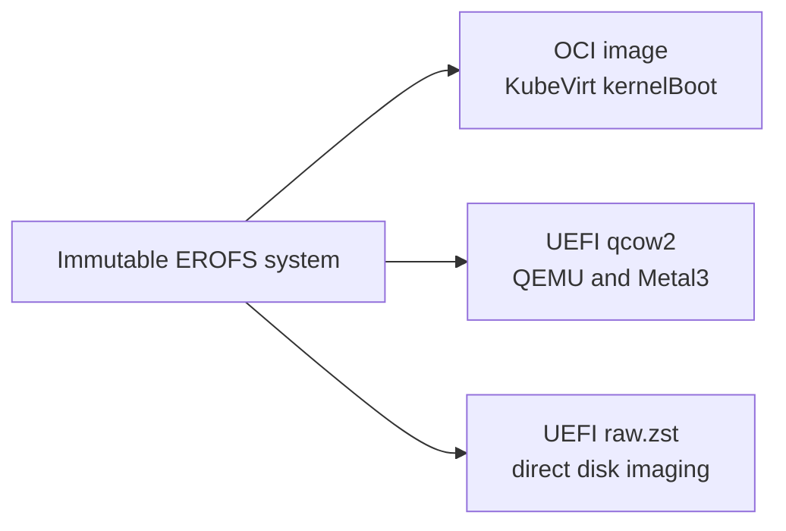

# Artifacts and releases

A k0smos release is tied to one exact upstream k0s release. The GitHub tag is the
k0s tag, for example `v1.36.3+k0s.0`; there is no independent OS version to pair
with it.

## One system payload, several wrappers

The canonical payload is a read-only EROFS filesystem containing k0smos, k0s,
and their runtime files. Platform artifacts wrap that payload with the boot
mechanism and kernel needed by the target.



For a given architecture, the system inside each wrapper is identical. This
keeps the k0s binary, k0smos PID 1, and userspace consistent across platforms.

## Published artifacts

| Artifact | Consumer |
|---|---|
| `k0smos-metal-<arch>.qcow2` | `k0smosctl`, QEMU, libvirt, Metal3/Ironic |
| `k0smos-metal-<arch>.raw.zst` | imaging tools that write a complete disk |
| `k0smos-root-<arch>.erofs` | canonical payload; useful for verification and custom packaging |
| `k0smos-initramfs-<arch>.gz` | custom/direct-kernel integrations |
| `k0smos-<arch>.manifest` | k0s version, source commit, architecture, and root digest |
| `SHA256SUMS-<arch>.txt` | release checksums |

KubeVirt images are published to GHCR. Because `+` is not valid in an OCI tag,
the k0s tag is written with `-` there:

```text
ghcr.io/makhov/k0smos:v1.36.3-k0s.0-amd64
ghcr.io/makhov/k0smos:v1.36.3-k0s.0-arm64
```

## Disk layout

The qcow2 and raw images contain a GPT disk with:

| Partition | Purpose |
|---|---|
| EFI system partition | GRUB, kernel, and platform initramfs |
| `k0smos` | immutable EROFS system mounted read-only |
| `k0smos-data` | ext4 data partition mounted at `/var` |

The image is a machine template. Each machine gets its own disk or clone; never
boot the published or cached image in place.

## Building locally

Published artifacts are the normal installation path. Contributors can build
the platform wrappers with:

```bash
make metal   # qcow2 and raw disk
make oci     # local KubeVirt OCI image
```

These targets require Docker and Linux image-building tools. See the repository
Makefile for lower-level development targets.
