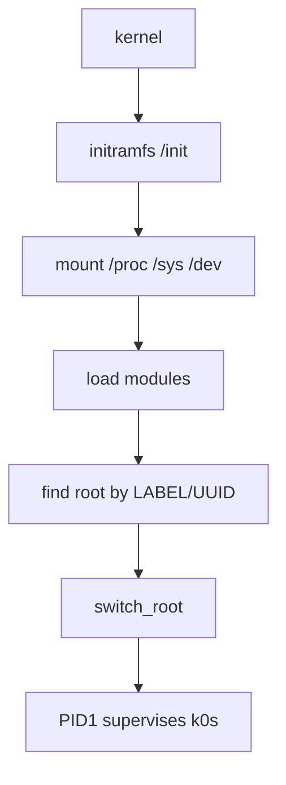

# The boot chain

Why the boot sequence is ordered the way it is. Nearly every step exists to
prevent a specific failure that was observed on a real boot; the ordering looks
arbitrary until you know what each one is for.

This is the *why*. For the normal workflow, see [Get started](../install/quick-start.md);
for KubeVirt or Cluster API, see [KubeVirt](../deployment/kubevirt.md).



```
firmware/QEMU/KubeVirt
  └── kernel (Kata guest kernel by default, Alpine linux-virt, or your own)
        └── initramfs: k0smos as /init          ← PID1, pre-switch
              ├── mount /proc /sys /dev /run /tmp …
              ├── read /proc/cmdline
              ├── export PATH                    (mkfs and k0s both need it)
              ├── load modules: named set, then autoload by modalias
              ├── choose root: explicit override → embedded EROFS → LABEL=k0smos
              ├── mount it at /newroot
              └── switch_root ── exec /sbin/k0smos --switched-root
                    └── k0smos as /sbin/k0smos   ← PID1, post-switch
                          ├── mount anything that did not come across
                          ├── load modules (again; harmless if already in)
                          ├── prepare the data volume → /var
                          ├── set up cgroup2
                          ├── loopback up
                          ├── read the cloud-init drive (no mount)
                          ├── network: DHCP or static, write /etc/resolv.conf
                          │     ├── write_files → syscalls
                          │     ├── runcmd → interpreted, never executed
                          │     └── meta-data may supply the hostname
                          ├── set hostname
                          ├── install SIGCHLD reaper
                          ├── watch control port + power button
                          ├── supervise the workload
                          │     (k0s controller --single, unless user-data
                          │      names a role and join token)
                          └── on shutdown request:
                                k0s etcd leave (controllers, not --single)
                                killall TERM → grace → KILL
                                sync → unmount → sync → remount / ro
                                reboot(2)
```

Two orderings in there are load-bearing and easy to get backwards: the data volume
is mounted before anything can write to `/var`, and the cloud-init drive is read
before networking so it can supply the machine's address.
