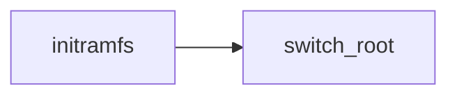
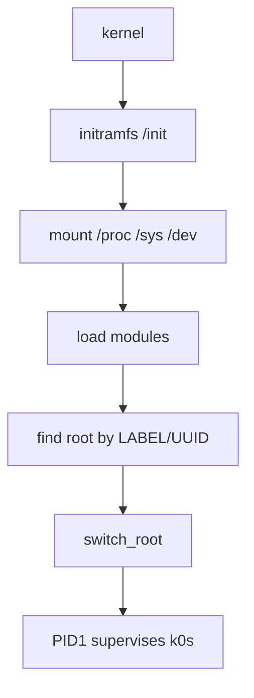

# MkDocs Documentation Site Implementation Plan

> **For agentic workers:** REQUIRED SUB-SKILL: Use superpowers:subagent-driven-development (recommended) or superpowers:executing-plans to implement this plan task-by-task. Steps use checkbox (`- [ ]`) syntax for tracking.

**Goal:** Publish k0smos's existing documentation as a versioned MkDocs site, following the setup k0s and k0smotron use.

**Architecture:** `mkdocs.yml` at the repository root with `docs_dir: docs/`, mkdocs-material theme, `mike` for per-version deploys to GitHub Pages. Content is the four existing documents re-cut into the nav shape k0s uses, de-duplicated where two of them cover the same ground. Machinery lands first so every content task can be verified by `mkdocs build --strict`.

**Tech Stack:** MkDocs 1.6, mkdocs-material 9.6, mike 2.1, mkdocs-macros-plugin, mkdocs-exclude, Python 3.10 in the dev container, GitHub Actions.

## Global Constraints

- Spec: `docs/superpowers/specs/2026-08-01-mkdocs-site-design.md`. Read it before starting.
- `mkdocs.yml` lives at the repository root. MkDocs rejects a config file inside its own `docs_dir`.
- Every build is `mkdocs build --strict`. A warning is an error: broken internal links, nav entries pointing at missing files, and files under `docs/` that no nav entry references all fail the build.
- `docs/superpowers/**` must be excluded from the site. It holds specs and plans, including this file.
- `site_url: https://makhov.github.io/k0smos/`, `repo_url: https://github.com/makhov/k0smos`.
- No `k0s_version` macro. `image/fetch-k0s.sh` resolves the latest stable k0s release at build time and pins nothing; documentation says "latest stable".
- `k0smos_version` is a macro (a function), never a plain variable. An undefined variable renders empty and passes the build; an undefined macro raises and fails it.
- Prose is moved, not rewritten, except for the three pages named in Task 10, Task 12 and Task 13. Preserve the existing voice.
- Work on a branch off `main`. Do not commit to `main`.
- Docker works. Everything in this plan is verifiable locally, including the dev container.

---

## File Structure

Machinery:

| Path | Responsibility |
|---|---|
| `mkdocs.yml` | site config: theme, nav, plugins, markdown extensions, mike |
| `docs/requirements.txt` | pinned MkDocs stack |
| `docs/requirements_pip.txt` | pinned pip and wheel |
| `docs/Makefile` | `docs` target and the pip-requirements refresh target |
| `docs/Makefile.variables` | python and alpine versions for the dev container |
| `docs/Dockerfile.serve-dev` | containerised `mkdocs serve` |
| `docs/mkdocs_modules/k0smos_macros.py` | defines the `k0smos_version` macro |
| `docs/stylesheets/extra.css` | palette overrides |
| `docs/custom_theme/main.html` | out-of-date-version banner |
| `.github/workflows/docs.yml` | build on PRs touching docs |
| `.github/workflows/publish-docs.yml` | mike deploy to gh-pages |
| `Makefile` | root `docs` target delegating to `docs/Makefile` |

Content, one file per nav leaf:

```
docs/index.md                        Overview
docs/install/quick-start.md
docs/install/artifacts.md
docs/install/kernel.md
docs/usage/cli.md
docs/usage/boot.md
docs/usage/cloud-init.md
docs/usage/manifests.md
docs/usage/data-volume.md
docs/usage/kubeconfig.md
docs/usage/multi-node.md
docs/usage/shutdown.md
docs/deployment/artifacts.md
docs/deployment/libvirt.md
docs/deployment/kubevirt.md
docs/deployment/bare-metal.md
docs/deployment/cloud.md
docs/deployment/per-machine.md
docs/deployment/operating.md
docs/reference/cmdline.md
docs/reference/k0smosctl.md
docs/reference/env.md
docs/reference/rootfs.md
docs/design/boot-chain.md
docs/design/decisions.md
docs/design/testability.md
docs/troubleshooting.md
docs/known-limitations.md
docs/contributing/layout.md
docs/contributing/tests.md
docs/contributing/make.md
```

Deleted at the end, once empty: `docs/usage.md`, `docs/architecture.md`, `docs/deployment.md`.

---

### Task 1: MkDocs skeleton that builds

Gets a site building with the four existing documents before any content moves, so every later task has `mkdocs build --strict` as its check.

**Files:**
- Create: `mkdocs.yml`
- Create: `docs/requirements.txt`
- Create: `docs/Makefile`
- Modify: `Makefile` (add a `docs` target)
- Create: `.gitignore` entry for `site/`

**Interfaces:**
- Consumes: nothing.
- Produces: a working `make docs`; `mkdocs.yml` whose `nav`, `plugins` and `markdown_extensions` keys later tasks extend.

- [ ] **Step 1: Create the Python environment and install the pinned stack**

Create `docs/requirements.txt`:

```
certifi==2025.10.5
charset-normalizer==3.4.1
click==8.1.8
colorama==0.4.6
ghp-import==2.1.0
idna==3.11
Jinja2==3.1.6
Markdown==3.9
MarkupSafe==3.0.2
mdx-truly-sane-lists==1.3
mergedeep==1.3.4
mike==2.1.3
mkdocs==1.6.1
mkdocs-exclude==1.0.2
mkdocs-macros-plugin==1.4.0
mkdocs-material==9.6.22
mkdocs-material-extensions==1.3.1
packaging==25.0
Pygments==2.19.2
pymdown-extensions==10.16.1
pyparsing==3.2.5
python-dateutil==2.9.0.post0
PyYAML==6.0.2
pyyaml_env_tag==1.1
regex==2025.10.22
requests==2.32.5
six==1.17.0
termcolor==3.1.0
urllib3==2.4.0
verspec==0.1.0
watchdog==6.0.0
```

This is k0smotron's set with `mkdocs-ezglossary-plugin` removed — k0smos has no glossary.

Run:

```bash
python3 -m venv .venv-docs
.venv-docs/bin/pip install --disable-pip-version-check -r docs/requirements.txt
```

- [ ] **Step 2: Write `mkdocs.yml` with a nav over the documents that exist today**

```yaml
site_name: k0smos
site_description: A minimal Go PID1 that boots k0s Kubernetes nodes.
site_url: https://makhov.github.io/k0smos/
docs_dir: docs/
repo_name: GitHub
repo_url: https://github.com/makhov/k0smos
edit_uri: ""

nav:
  - Overview: README.md
  - Usage: usage.md
  - Architecture: architecture.md
  - Deployment: deployment.md

theme:
  name: "material"
  highlightjs: true
  language: "en"
  palette:
    - scheme: default
      toggle:
        icon: material/toggle-switch
        name: Switch to dark mode
    - scheme: slate
      toggle:
        icon: material/toggle-switch-off-outline
        name: Switch to light mode
  features:
    - toc.autohide
    - search.suggest
    - search.highlight
    - content.code.copy

plugins:
  - search
  - exclude:
      glob:
        - superpowers/*
        - superpowers/**/*
        - requirements*.txt
        - Makefile*
        - Dockerfile.serve-dev
        - mkdocs_modules/*

markdown_extensions:
  - pymdownx.highlight: {}
  - pymdownx.superfences: {}
  - pymdownx.inlinehilite: {}
  - mdx_truly_sane_lists:
      nested_indent: 2
      truly_sane: true
  - toc:
      permalink: "#"
      toc_depth: 3
  - admonition
  - footnotes

extra:
  generator: false
```

`README.md` is the nav's Overview only until Task 10 introduces `index.md`. It is here so the site builds now.

- [ ] **Step 3: Write `docs/Makefile`**

```makefile
include Makefile.variables

# mkdocs.yml cannot live in docs/, because MkDocs rejects a config file whose
# docs_dir is its own parent. Hence the cd.
.PHONY: docs
docs: .require-mkdocs
	cd .. && mkdocs build --strict

.PHONY: serve
serve: .require-mkdocs
	cd .. && mkdocs serve

.PHONY: .require-mkdocs
.require-mkdocs:
	@which mkdocs >/dev/null 2>/dev/null || { \
	  echo 'mkdocs required, use pip install --disable-pip-version-check -r $(CURDIR)/requirements.txt' >&2; \
	  exit 1; \
	}
```

Create `docs/Makefile.variables` now, because the include above needs it:

```makefile
python_version = 3.10.9
alpine_version = 3.20
```

- [ ] **Step 4: Add the root `docs` target**

The root Makefile is this project's entry point for every other task, so `make docs` must work from the root. Append to `Makefile`:

```makefile
# Documentation. The real targets live in docs/Makefile, matching how k0s and
# k0smotron lay this out; these delegate so the root stays the entry point.
.PHONY: docs docs-serve
docs:
	$(MAKE) -C docs docs

docs-serve:
	$(MAKE) -C docs serve
```

- [ ] **Step 5: Ignore the build output**

Append to `.gitignore`:

```
/site/
/.venv-docs/
```

- [ ] **Step 6: Verify the build passes**

Run: `PATH="$PWD/.venv-docs/bin:$PATH" make docs`
Expected: `INFO - Documentation built in ...`, exit 0, and `site/index.html` exists.

- [ ] **Step 7: Verify `--strict` actually fails on a broken link**

This proves the check the rest of the plan depends on is live.

```bash
printf '\n[broken](does-not-exist.md)\n' >> docs/usage.md
PATH="$PWD/.venv-docs/bin:$PATH" make docs; echo "exit=$?"
git checkout docs/usage.md
```

Expected: non-zero exit, with a warning naming `does-not-exist.md`. If it exits 0, `--strict` is not in effect — fix `docs/Makefile` before continuing.

- [ ] **Step 8: Verify the specs are excluded**

Run: `test ! -e site/superpowers && echo excluded`
Expected: `excluded`. If the directory exists, the exclude glob is wrong and internal plans would be published.

- [ ] **Step 9: Commit**

```bash
git add mkdocs.yml docs/requirements.txt docs/Makefile docs/Makefile.variables Makefile .gitignore
git commit -m "docs: build the documentation with MkDocs"
```

---

### Task 2: The version macro

**Files:**
- Create: `docs/mkdocs_modules/k0smos_macros.py`
- Modify: `mkdocs.yml` (add the `macros` plugin)

**Interfaces:**
- Consumes: `mkdocs.yml` from Task 1.
- Produces: the macro `k0smos_version()`, called in pages as `{{{ k0smos_version() }}}`.

- [ ] **Step 1: Write the macro module**

```python
"""Macros available to the documentation.

Values are exported as macros rather than variables on purpose. An undefined
variable renders as empty text and passes a --strict build, so a typo in a
version reference ships silently; an undefined macro raises and fails the
build. k0s does the same thing for the same reason.
"""

import os
import subprocess


def define_env(env):
    @env.macro
    def k0smos_version():
        """The release this documentation describes.

        K0SMOS_VERSION is set by CI, which knows whether it is building `head`
        or a tagged release. Locally it falls back to the most recent tag, so a
        working copy renders something real rather than a placeholder.
        """
        version = os.getenv("K0SMOS_VERSION")
        if version:
            return version
        try:
            return subprocess.check_output(
                ["git", "describe", "--tags", "--abbrev=0"],
                stderr=subprocess.DEVNULL,
                text=True,
            ).strip()
        except (subprocess.CalledProcessError, FileNotFoundError):
            # A source tarball has no git history. Better a visible placeholder
            # than a build that fails for someone who only wants to read.
            return "latest"
```

- [ ] **Step 2: Register the plugin in `mkdocs.yml`**

Replace the `plugins:` block's `- search` line with:

```yaml
plugins:
  - search
  - macros:
      j2_variable_start_string: "{{{"
      j2_variable_end_string: "}}}"
      j2_block_start_string: "[[%"
      j2_block_end_string: "%]]"
      modules:
        - mkdocs_modules.k0smos_macros
```

The non-default delimiters are k0s's and k0smotron's: documentation is full of shell and YAML using `{{ }}`, and Jinja would otherwise try to evaluate it.

Add the module directory to Python's path by setting it in `docs/Makefile`'s `docs` and `serve` targets:

```makefile
docs: .require-mkdocs
	cd .. && PYTHONPATH="$(CURDIR)" mkdocs build --strict

serve: .require-mkdocs
	cd .. && PYTHONPATH="$(CURDIR)" mkdocs serve
```

- [ ] **Step 3: Verify the macro renders**

```bash
printf '\nVersion: {{{ k0smos_version() }}}\n' >> docs/usage.md
PATH="$PWD/.venv-docs/bin:$PATH" make docs
grep -o "Version: v[0-9.]*" site/usage/index.html
```

Expected: `Version: v0.0.1` (the current tag).

- [ ] **Step 4: Verify an unknown macro fails the build**

This is the property the whole design rests on.

```bash
printf '\n{{{ k0smos_versoin() }}}\n' >> docs/usage.md
PATH="$PWD/.venv-docs/bin:$PATH" make docs; echo "exit=$?"
git checkout docs/usage.md
```

Expected: non-zero exit naming the undefined macro. If it exits 0, the macros plugin is not loaded — check `PYTHONPATH` and the module name.

- [ ] **Step 5: Verify the env override**

```bash
printf '\nVersion: {{{ k0smos_version() }}}\n' >> docs/usage.md
K0SMOS_VERSION=v9.9.9 PATH="$PWD/.venv-docs/bin:$PATH" make docs
grep -o "Version: v9.9.9" site/usage/index.html
git checkout docs/usage.md
```

Expected: `Version: v9.9.9`.

- [ ] **Step 6: Commit**

```bash
git add docs/mkdocs_modules/k0smos_macros.py mkdocs.yml docs/Makefile
git commit -m "docs: add a k0smos_version macro"
```

---

### Task 3: Theme, mermaid and the stale-version banner

**Files:**
- Create: `docs/stylesheets/extra.css`
- Create: `docs/custom_theme/main.html`
- Modify: `mkdocs.yml`

**Interfaces:**
- Consumes: `mkdocs.yml` from Task 2.
- Produces: mermaid fences usable by any later page; the `mike` version selector.

- [ ] **Step 1: Write the stylesheet**

```css
/* k0smos blue, applied to the header, links and footer. */
:root {
  --md-primary-fg-color:        #326ce5;
  --md-accent-fg-color:         #326ce5;
}

:root > * {
  --md-footer-bg-color:         #326ce5;
}

/* The version selector overflows once there are more than a few releases. */
.md-version__list {
  overflow: auto;
}
```

- [ ] **Step 2: Write the theme override**

`mike` renders this block on any page that is not the default version.

```html



You are not viewing the documentation for the current stable release of k0smos.
<a href="{{ '../' ~ base_url }}">
  <strong>Click here for the current stable release.</strong>
</a>

```

No analytics block: k0smotron's `main.html` carries a Google Analytics tag, which is theirs and not wanted here.

- [ ] **Step 3: Wire it into `mkdocs.yml`**

Add to `theme:`:

```yaml
  custom_dir: docs/custom_theme
```

After the `theme:` block:

```yaml
extra_css:
  - stylesheets/extra.css
```

Add the mermaid fence to `markdown_extensions:`:

```yaml
  - pymdownx.superfences:
      custom_fences:
        - name: mermaid
          class: mermaid
          format: !!python/name:pymdownx.superfences.fence_code_format
```

Add the version selector to `extra:`:

```yaml
extra:
  generator: false
  version:
    provider: mike
    default: stable
```

- [ ] **Step 4: Verify mermaid renders as a diagram, not a code block**

```bash
cat >> docs/usage.md <<'EOF'


EOF
PATH="$PWD/.venv-docs/bin:$PATH" make docs
grep -c 'class="mermaid"' site/usage/index.html
git checkout docs/usage.md
```

Expected: at least `1`. A `0` means the custom fence is not registered and the diagram would ship as unrendered text.

- [ ] **Step 5: Verify the build still passes and the stylesheet is present**

Run: `PATH="$PWD/.venv-docs/bin:$PATH" make docs && test -e site/stylesheets/extra.css && echo ok`
Expected: `ok`.

- [ ] **Step 6: Commit**

```bash
git add docs/stylesheets/extra.css docs/custom_theme/main.html mkdocs.yml
git commit -m "docs: theme, mermaid diagrams and the stale-version banner"
```

---

### Task 4: The dev container

**Files:**
- Create: `docs/Dockerfile.serve-dev`
- Create: `docs/requirements_pip.txt`
- Modify: `docs/Makefile`

**Interfaces:**
- Consumes: `docs/requirements.txt` and `docs/Makefile.variables` from Task 1.
- Produces: the `.docker-image.serve-dev.stamp` target that `.github/workflows/docs.yml` calls in Task 5.

- [ ] **Step 1: Pin pip and wheel**

`docs/requirements_pip.txt`:

```
pip==25.2
wheel==0.45.1
```

The spec calls these "hash-pinned"; they are version-pinned. k0smotron's refresh target passes `--generate-hashes` but its committed file carries no hashes, and matching the file that exists is worth more than matching its description. Correct the spec's wording as part of this task.

- [ ] **Step 2: Write the Dockerfile**

```dockerfile
ARG PYTHON_IMAGE_VERSION

FROM python:${PYTHON_IMAGE_VERSION}

ENV PYTHONUNBUFFERED=1

COPY ./requirements_pip.txt ./requirements.txt /mkdocs/

RUN pip install --disable-pip-version-check -r /mkdocs/requirements_pip.txt \
  && pip --version \
  && pip install --disable-pip-version-check -r /mkdocs/requirements.txt

WORKDIR /k0smos

EXPOSE 8000

ENTRYPOINT ["mkdocs"]
CMD ["serve", "--dev-addr=0.0.0.0:8000"]
```

Simpler than k0smotron's: theirs has a `builder` stage that is never used as one, an `apk add python3` inside a `python:` image that already has it, and a `VIRTUAL_ENV` pointing at `/deps/venv` while `PATH` points at `/mkdocs/venv` — a copy that does not do what it appears to. None of that is worth carrying over.

- [ ] **Step 3: Add the container targets to `docs/Makefile`**

```makefile
.docker-image.serve-dev.stamp: Dockerfile.serve-dev requirements_pip.txt requirements.txt Makefile.variables
	docker build \
	  --build-arg PYTHON_IMAGE_VERSION=$(python_version)-alpine$(alpine_version) \
	  -t 'k0smosdocs$(basename $@)' -f '$<' .
	touch -- '$@'

# Serve the site from the container, so no local Python is needed.
.PHONY: serve-dev
serve-dev: .docker-image.serve-dev.stamp
	docker run --rm -it -p 8000:8000 -v '$(CURDIR)/..:/k0smos' k0smosdocs.docker-image.serve-dev

.PHONY: update-pip-requirements
update-pip-requirements: .docker-image.serve-dev.stamp
	docker run --rm --entrypoint sh k0smosdocs.docker-image.serve-dev -c \
	'pip install --disable-pip-version-check pip-tools > /dev/null \
	  && echo pip | pip-compile --allow-unsafe --output-file - - | grep -E -v "^ *#" \
	  && echo wheel | pip-compile --allow-unsafe --output-file - - | grep -E -v "^ *#"' \
	  > requirements_pip.txt.tmp
	mv -- requirements_pip.txt.tmp requirements_pip.txt
```

Add the stamp file to `.gitignore`:

```
/docs/.docker-image.serve-dev.stamp
```

- [ ] **Step 4: Build the container and serve from it**

Run: `make -C docs .docker-image.serve-dev.stamp`
Expected: the image builds and `docs/.docker-image.serve-dev.stamp` exists.

Then check it actually serves, which is the point of it:

```bash
make -C docs serve-dev &
sleep 15
curl -sf http://127.0.0.1:8000/ | grep -q k0smos && echo "serving"
kill %1
```
Expected: `serving`. A container that builds but cannot serve is worse than none, because it looks fine in CI.

- [ ] **Step 5: Correct the spec**

In `docs/superpowers/specs/2026-08-01-mkdocs-site-design.md`, change the `docs/requirements_pip.txt` row from "hash-pinned pip/wheel + pip-compile refresh target" to "pinned pip and wheel, with a pip-compile refresh target", and change the "Hash-pinned requirements" decision row to "Pinned requirements".

- [ ] **Step 6: Commit**

```bash
git add docs/Dockerfile.serve-dev docs/requirements_pip.txt docs/Makefile .gitignore \
  docs/superpowers/specs/2026-08-01-mkdocs-site-design.md
git commit -m "docs: containerised mkdocs serve for contributors without Python"
```

---

### Task 5: CI

**Files:**
- Create: `.github/workflows/docs.yml`
- Create: `.github/workflows/publish-docs.yml`

**Interfaces:**
- Consumes: `make -C docs docs` and `make -C docs .docker-image.serve-dev.stamp` from Tasks 1 and 4.
- Produces: nothing later tasks consume. Both workflows must exist before content moves, so every content PR is checked.

- [ ] **Step 1: Write the build workflow**

`.github/workflows/docs.yml`:

```yaml
name: Build docs

on:
  pull_request:
    branches:
      - main
    paths:
      - mkdocs.yml
      - docs/**
      - .github/workflows/docs.yml

env:
  PYTHON_VERSION: "3.10"

jobs:
  build:
    name: Build docs
    runs-on: ubuntu-latest
    steps:
      - uses: actions/checkout@v4
        with:
          # mike and the version macro both read tags.
          fetch-depth: 0

      - uses: actions/setup-python@v5
        with:
          python-version: ${{ env.PYTHON_VERSION }}
          cache: pip
          cache-dependency-path: docs/requirements.txt

      - name: Install dependencies
        run: |
          pip install --disable-pip-version-check -r docs/requirements_pip.txt
          pip --version
          pip install --disable-pip-version-check -r docs/requirements.txt

      - name: Build
        run: make -C docs docs

  dev-container:
    name: Build docs dev container
    runs-on: ubuntu-latest
    steps:
      - uses: actions/checkout@v4
      - name: Build
        run: make -C docs .docker-image.serve-dev.stamp
```

- [ ] **Step 2: Write the publish workflow**

`.github/workflows/publish-docs.yml`:

```yaml
name: Publish docs

on:
  push:
    branches:
      - main
  release:
    types:
      - published

env:
  PYTHON_VERSION: "3.10"

permissions:
  contents: write

jobs:
  deploy:
    name: Deploy docs
    runs-on: ubuntu-latest
    steps:
      - uses: actions/checkout@v4
        with:
          fetch-depth: 0

      - uses: actions/setup-python@v5
        with:
          python-version: ${{ env.PYTHON_VERSION }}
          cache: pip
          cache-dependency-path: docs/requirements.txt

      - name: Install dependencies
        run: |
          pip install --disable-pip-version-check -r docs/requirements_pip.txt
          pip --version
          pip install --disable-pip-version-check -r docs/requirements.txt

      - name: Build
        run: make -C docs docs

      - name: git config
        run: |
          git config --local user.email "action@github.com"
          git config --local user.name "GitHub Action"

      # Merges to main publish as "head", which is what the docs for unreleased
      # code should be called.
      - name: mike deploy head
        if: github.ref == 'refs/heads/main'
        run: |
          K0SMOS_VERSION=head mike deploy --push head

      - name: mike deploy release
        if: >-
          github.event_name == 'release' &&
          github.event.action == 'published' &&
          !github.event.release.draft &&
          !github.event.release.prerelease
        env:
          VERSION: ${{ github.event.release.tag_name }}
        run: |
          K0SMOS_VERSION="$VERSION" mike deploy --push "$VERSION"

      # stable points at the newest non-prerelease tag, and is what a visitor
      # to the bare site URL gets.
      - name: Update aliases
        env:
          GITHUB_TOKEN: ${{ secrets.GITHUB_TOKEN }}
        run: |
          mike alias -u head main
          STABLE=$(gh release list -L 100 --exclude-drafts --exclude-pre-releases \
            --json tagName --jq '.[].tagName' | sort -V | tail -1)
          if [ -n "$STABLE" ]; then
            mike alias -u "$STABLE" stable
            mike set-default --push stable
          fi
```

- [ ] **Step 3: Verify the workflows parse**

Run: `python3 -c "import yaml,sys; [yaml.safe_load(open(f)) for f in sys.argv[1:]]; print('ok')" .github/workflows/docs.yml .github/workflows/publish-docs.yml`
Expected: `ok`.

- [ ] **Step 4: Verify the build workflow's own command works**

Run: `PATH="$PWD/.venv-docs/bin:$PATH" make -C docs docs`
Expected: exit 0. This is the exact command CI runs.

- [ ] **Step 5: Commit**

```bash
git add .github/workflows/docs.yml .github/workflows/publish-docs.yml
git commit -m "docs: build on PRs and publish versioned docs to GitHub Pages"
```

---

### Task 6: Installation section

The first content move. Establishes the pattern the remaining content tasks follow: create the destination pages, cut the source sections, update the nav, build strict, commit.

**Files:**
- Create: `docs/install/quick-start.md`, `docs/install/artifacts.md`, `docs/install/kernel.md`
- Modify: `README.md` (remove the three moved sections), `mkdocs.yml`

**Interfaces:**
- Consumes: the skeleton from Tasks 1-3.
- Produces: `install/quick-start.md`, which later pages link to as the entry point.

- [ ] **Step 1: Create the pages from the README's sections**

Move verbatim, adding an H1 to each and adjusting the heading levels beneath it:

| New file | README section | Lines (approximate, re-check) |
|---|---|---|
| `docs/install/quick-start.md` | `## Quick start` | 21-72 |
| `docs/install/artifacts.md` | `## What gets built` | 73-83 |
| `docs/install/kernel.md` | `## Which kernel` | 265-284 |

Do not rewrite the prose. The one edit each page needs is the H1: `# Quick start`, `# What gets built`, `# Which kernel`.

- [ ] **Step 2: Remove those sections from the README**

Delete them. The README's quick start is restored in Task 13 as a five-line version; leaving the full one here would mean the same text in two files while the rest of the plan runs.

- [ ] **Step 3: Update the nav**

```yaml
nav:
  - Overview: README.md
  - Installation:
      - Quick start: install/quick-start.md
      - What gets built: install/artifacts.md
      - Which kernel: install/kernel.md
  - Usage: usage.md
  - Architecture: architecture.md
  - Deployment: deployment.md
```

- [ ] **Step 4: Verify the build passes and nothing was orphaned**

Run: `PATH="$PWD/.venv-docs/bin:$PATH" make docs`
Expected: exit 0. A page created but not added to the nav fails here, which is the check that a moved section did not get lost.

- [ ] **Step 5: Verify the content actually moved**

```bash
grep -q "Quick start" site/install/quick-start/index.html && echo "moved"
grep -c "^## Quick start" README.md
```

Expected: `moved`, then `0`.

- [ ] **Step 6: Commit**

```bash
git add docs/install README.md mkdocs.yml
git commit -m "docs: move installation into the site"
```

---

### Task 7: Usage section

**Files:**
- Create: `docs/usage/cli.md`, `boot.md`, `cloud-init.md`, `manifests.md`, `data-volume.md`, `kubeconfig.md`, `multi-node.md`, `shutdown.md`
- Modify: `docs/usage.md` (emptied of the moved sections), `README.md`, `mkdocs.yml`

**Interfaces:**
- Consumes: Task 6's pattern.
- Produces: `usage/multi-node.md`, which `docs/reference/k0smosctl.md` links to in Task 9.

- [ ] **Step 1: Create the pages**

| New file | Sources |
|---|---|
| `docs/usage/cli.md` | `usage.md` "The CLI" + README "Talking to a running node" |
| `docs/usage/boot.md` | `usage.md` "Boot a node locally" |
| `docs/usage/cloud-init.md` | `usage.md` "Configure a node with cloud-init" |
| `docs/usage/manifests.md` | `usage.md` "Ship Kubernetes manifests" |
| `docs/usage/data-volume.md` | `usage.md` "Give it a data volume" + README "The data volume" |
| `docs/usage/kubeconfig.md` | `usage.md` "Reach the cluster from the host" |
| `docs/usage/multi-node.md` | `usage.md` "More than one node" |
| `docs/usage/shutdown.md` | `usage.md` "Shut it down" |

Two pages have two sources and need merging rather than concatenation:

**`cli.md`** — `usage.md`'s "The CLI" is the command table; the README's "Talking to a running node" covers the control port and the security note. Result: the table, then what the control port is and why a node has no SSH, then the caution about who can write to it. Drop the duplicated `k0smosctl kubeconfig` example, keeping the README's, which is shorter.

**`data-volume.md`** — the README's "The data volume" explains what it is for; `usage.md`'s "Give it a data volume" is the how-to. Result: purpose first, then the commands. Both mention `k0smos.data=auto`; keep one description of it.

- [ ] **Step 2: Remove the moved sections from their sources**

Delete them from `docs/usage.md` and `README.md`. `docs/usage.md` should be left holding only "Run it on KubeVirt", "Run it on bare metal" and "When something goes wrong", which Tasks 8 and 12 take.

- [ ] **Step 3: Update the nav**

```yaml
  - Usage:
      - The CLI: usage/cli.md
      - Boot a node locally: usage/boot.md
      - Configure with cloud-init: usage/cloud-init.md
      - Ship Kubernetes manifests: usage/manifests.md
      - The data volume: usage/data-volume.md
      - Reach the cluster: usage/kubeconfig.md
      - A multi-node cluster: usage/multi-node.md
      - Shut it down: usage/shutdown.md
```

Keep `- Leftovers: usage.md` in the nav until Task 12 empties it, or `--strict` fails on a file no nav entry references.

- [ ] **Step 4: Fix the links that pointed into the old file**

`README.md:122` and `README.md:143` link to `docs/usage.md#configure-a-node-with-cloud-init` and `docs/usage.md#more-than-one-node`. Repoint them at `docs/usage/cloud-init.md` and `docs/usage/multi-node.md`.

- [ ] **Step 5: Verify**

Run: `PATH="$PWD/.venv-docs/bin:$PATH" make docs`
Expected: exit 0. Broken anchors from step 4 fail here.

```bash
grep -rn "usage.md#" README.md docs/ --include="*.md" | grep -v superpowers
```
Expected: no output.

- [ ] **Step 6: Commit**

```bash
git add docs/usage docs/usage.md README.md mkdocs.yml
git commit -m "docs: move usage into the site"
```

---

### Task 8: Deployment section

**Files:**
- Create: `docs/deployment/artifacts.md`, `libvirt.md`, `kubevirt.md`, `bare-metal.md`, `cloud.md`, `per-machine.md`, `operating.md`
- Delete: `docs/deployment.md`
- Modify: `docs/usage.md`, `mkdocs.yml`, `.github/workflows/release.yml:138`

**Interfaces:**
- Consumes: Task 7's `docs/usage.md`, now holding only the two platform sections and troubleshooting.
- Produces: nothing later tasks consume.

- [ ] **Step 1: Create the pages**

| New file | Sources |
|---|---|
| `docs/deployment/artifacts.md` | `deployment.md` "What you ship" |
| `docs/deployment/libvirt.md` | `deployment.md` "KVM / libvirt" |
| `docs/deployment/kubevirt.md` | `deployment.md` "KubeVirt (and Cluster API…)" + `usage.md` "Run it on KubeVirt" |
| `docs/deployment/bare-metal.md` | `deployment.md` "Bare metal" + `usage.md` "Run it on bare metal" |
| `docs/deployment/cloud.md` | `deployment.md` "Cloud" |
| `docs/deployment/per-machine.md` | `deployment.md` "Per-machine configuration" |
| `docs/deployment/operating.md` | `deployment.md` "Operating it" |

- [ ] **Step 2: Resolve the KubeVirt disagreement against the code**

The two KubeVirt sections disagree about whether a `containerDisk` is required. `image/mkoci.sh` is the authority: it builds one image carrying the kernel and initramfs, and includes `/disk` only when `IMG=` is given. Read it, then write the merged page to match what it actually produces. Do not average the two descriptions.

Run: `sed -n '1,60p' image/mkoci.sh` before writing the page.

- [ ] **Step 3: Check the bare-metal pages against the spec's finding**

The spec records that `dist/k0smos.img` has no MBR, no GPT and no bootloader, so it cannot serve Ironic's standard disk-image deploy; metal3's fit is the ramdisk deploy interface with `image.diskFormat: live-iso`, or `DEPLOY_KERNEL_URL`/`DEPLOY_RAMDISK_URL`. If either source page claims otherwise, correct it.

Verify the claim still holds rather than trusting the spec:

```bash
python3 -c "
d=open('dist/k0smos.img','rb').read(1024)
print('MBR:', d[510]==0x55 and d[511]==0xaa)"
```
Expected: `MBR: False`. If `dist/k0smos.img` does not exist, `make disk` builds it.

- [ ] **Step 4: Delete the source and update the nav**

```bash
git rm docs/deployment.md
```

```yaml
  - Deployment:
      - What you ship: deployment/artifacts.md
      - KVM / libvirt: deployment/libvirt.md
      - KubeVirt and Cluster API: deployment/kubevirt.md
      - Bare metal: deployment/bare-metal.md
      - Cloud: deployment/cloud.md
      - Per-machine configuration: deployment/per-machine.md
      - Operating it: deployment/operating.md
```

- [ ] **Step 5: Fix the reference from the release workflow**

`.github/workflows/release.yml:138` says "see docs/usage.md". Change it to point at the site: `see https://makhov.github.io/k0smos/usage/cloud-init/`.

- [ ] **Step 6: Verify**

Run: `PATH="$PWD/.venv-docs/bin:$PATH" make docs`
Expected: exit 0.

```bash
test ! -e docs/deployment.md && echo "source removed"
grep -rn "docs/deployment.md" --include="*.md" --include="*.yml" . | grep -v superpowers
```
Expected: `source removed`, then no output.

- [ ] **Step 7: Commit**

```bash
git add -A docs/deployment docs/deployment.md docs/usage.md mkdocs.yml .github/workflows/release.yml
git commit -m "docs: move deployment into the site"
```

---

### Task 9: Reference section

**Files:**
- Create: `docs/reference/cmdline.md`, `k0smosctl.md`, `env.md`, `rootfs.md`
- Modify: `README.md`, `mkdocs.yml`

**Interfaces:**
- Consumes: `docs/usage/cli.md` from Task 7, which `k0smosctl.md` links to for the narrative.
- Produces: nothing later tasks consume.

- [ ] **Step 1: Move the three existing reference sections**

| New file | README section |
|---|---|
| `docs/reference/cmdline.md` | "Kernel cmdline options" |
| `docs/reference/env.md` | "Script environment variables" |
| `docs/reference/rootfs.md` | "The read-only root (erofs)" |

`rootfs.md` is here rather than under Design because it is operational — which `ROOTFS` value produces what, and which kernels can mount it. The rationale stays in `design/decisions.md` ("Why a read-only root works at all"). Add a link from each to the other.

- [ ] **Step 2: Generate the k0smosctl reference**

Build the CLI and capture help for every command, so the page cannot drift from the code by transcription error:

```bash
go build -o /tmp/k0smosctl ./cmd/k0smosctl
for c in gen boot logs list kubeconfig token shutdown reboot rm; do
  echo "### k0smosctl $c"
  /tmp/k0smosctl "$c" --help
done
```

Write `docs/reference/k0smosctl.md` as: one sentence on what the CLI is and a link to `../usage/cli.md` for the narrative, then one section per command containing its description and a flag table taken from the captured output.

- [ ] **Step 3: Note the staleness risk in the page itself**

At the top of `k0smosctl.md`, state that the flag tables are generated from `--help` and how to regenerate them, so the next person to add a flag knows what to do. The spec accepts this as a known risk; the mitigation is that the instruction is on the page.

- [ ] **Step 4: Update the nav**

```yaml
  - Reference:
      - Kernel cmdline options: reference/cmdline.md
      - k0smosctl: reference/k0smosctl.md
      - Script environment variables: reference/env.md
      - The read-only root: reference/rootfs.md
```

- [ ] **Step 5: Verify every command is documented**

```bash
/tmp/k0smosctl --help | awk '/Available Commands:/,/^Flags:/' | awk 'NF && $1 !~ /:/ {print $1}' \
  | grep -v -e completion -e help | while read -r c; do
    grep -q "k0smosctl $c" docs/reference/k0smosctl.md || echo "MISSING: $c"
  done
```
Expected: no `MISSING:` lines.

- [ ] **Step 6: Verify the build**

Run: `PATH="$PWD/.venv-docs/bin:$PATH" make docs`
Expected: exit 0.

- [ ] **Step 7: Commit**

```bash
git add docs/reference README.md mkdocs.yml
git commit -m "docs: reference section, with a generated k0smosctl page"
```

---

### Task 10: Design section and the Overview page

**Files:**
- Create: `docs/design/boot-chain.md`, `decisions.md`, `testability.md`, `docs/index.md`
- Delete: `docs/architecture.md`
- Modify: `mkdocs.yml`

**Interfaces:**
- Consumes: every section created so far, which `index.md` links to.
- Produces: `index.md` as the site root, replacing `README.md` in the nav.

- [ ] **Step 1: Split architecture.md**

| New file | architecture.md sections |
|---|---|
| `docs/design/boot-chain.md` | "The boot chain" |
| `docs/design/decisions.md` | every "Why …" section, in the existing order |
| `docs/design/testability.md` | "Testability" |

One `decisions.md` rather than ten pages: the sections total under 300 lines, are read in sequence, and each is too small to stand alone.

- [ ] **Step 2: Consider a mermaid diagram for the boot chain**

The boot chain is currently prose describing an ordered sequence, which is what mermaid is for. If it converts cleanly, add:

````

````

Keep the prose. The diagram is a summary, not a replacement — the prose says why each step is where it is, which a diagram cannot.

- [ ] **Step 3: Write the Overview page**

`docs/index.md`. New prose, short. Cover: what k0smos is (a minimal Go PID1 that boots k0s nodes — no shell, no busybox, no systemd), what it is for, and links into Installation, Usage and Design. Take the framing from the README's opening rather than inventing a new one.

- [ ] **Step 4: Update the nav**

Replace `- Overview: README.md` with `- Overview: index.md`. The README is no longer part of the site.

```bash
git rm docs/architecture.md
```

- [ ] **Step 5: Verify the README is no longer built**

Run: `PATH="$PWD/.venv-docs/bin:$PATH" make docs`
Expected: exit 0.

MkDocs only reads files under `docs_dir`, and `README.md` is at the repository root, so removing it from the nav is enough — it was reachable before only because the nav named it. Confirm the site root is the new page:

```bash
grep -q "k0smos" site/index.html && echo ok
```
Expected: `ok`.

- [ ] **Step 6: Commit**

```bash
git add -A docs/design docs/index.md docs/architecture.md mkdocs.yml
git commit -m "docs: design section and an overview page"
```

---

### Task 11: Troubleshooting and known limitations

**Files:**
- Create: `docs/troubleshooting.md`, `docs/known-limitations.md`
- Delete: `docs/usage.md`
- Modify: `README.md`, `mkdocs.yml`

**Interfaces:**
- Consumes: the remains of `docs/usage.md` from Task 8.
- Produces: nothing later tasks consume.

- [ ] **Step 1: Write the troubleshooting page**

Merge two sources that overlap: `usage.md`'s "When something goes wrong" is symptom-first, the README's "Debugging" is tool-first. The merged page is symptom-first — a reader arrives with a symptom, not with a tool — naming the relevant tool inside each symptom. The README's two ways in (read the console; use the control port) become a short preamble.

- [ ] **Step 2: Write the known-limitations page**

Concatenate the README's "Limitations" and `deployment.md`'s "Still missing for production" (recover the latter from git: `git show HEAD~3:docs/deployment.md`, adjusting the ref as needed). Where they overlap, keep one statement. Both are lists of things that do not work yet; keep them as one list rather than two sections, and do not soften anything.

- [ ] **Step 3: Delete the emptied source**

```bash
git rm docs/usage.md
```

Remove the `- Leftovers: usage.md` nav entry added in Task 7.

- [ ] **Step 4: Update the nav**

```yaml
  - Troubleshooting: troubleshooting.md
  - Known limitations: known-limitations.md
```

Placed after Design and before Contributing, matching k0s's ordering.

- [ ] **Step 5: Verify**

Run: `PATH="$PWD/.venv-docs/bin:$PATH" make docs`
Expected: exit 0.

```bash
test ! -e docs/usage.md && test ! -e docs/architecture.md && test ! -e docs/deployment.md && echo "sources gone"
```
Expected: `sources gone`.

- [ ] **Step 6: Commit**

```bash
git add -A docs/troubleshooting.md docs/known-limitations.md docs/usage.md README.md mkdocs.yml
git commit -m "docs: troubleshooting and known limitations"
```

---

### Task 12: Contributing section

**Files:**
- Create: `docs/contributing/layout.md`, `tests.md`, `make.md`
- Modify: `README.md`, `mkdocs.yml`

**Interfaces:**
- Consumes: nothing from earlier content tasks.
- Produces: nothing later tasks consume.

- [ ] **Step 1: Move the three sections**

| New file | README section |
|---|---|
| `docs/contributing/layout.md` | "Layout" |
| `docs/contributing/tests.md` | "Tests" |
| `docs/contributing/make.md` | "Make targets" |

`tests.md` should mention the three-node cluster test and that it needs `./image/fetch-airgap.sh` first, which the README already says.

- [ ] **Step 2: Add the docs targets to the make page**

`make docs` and `make docs-serve` exist as of Task 1 and are not in the README's table. Add them, along with `make -C docs serve-dev` for the container.

- [ ] **Step 3: Update the nav**

```yaml
  - Contributing:
      - Repository layout: contributing/layout.md
      - Running the tests: contributing/tests.md
      - Make targets: contributing/make.md
```

- [ ] **Step 4: Verify**

Run: `PATH="$PWD/.venv-docs/bin:$PATH" make docs`
Expected: exit 0.

- [ ] **Step 5: Commit**

```bash
git add docs/contributing README.md mkdocs.yml
git commit -m "docs: contributing section"
```

---

### Task 13: Reduce the README and sweep the whole site

**Files:**
- Modify: `README.md`
- Verify: everything

**Interfaces:**
- Consumes: the complete site.
- Produces: the finished state.

- [ ] **Step 1: Rewrite the README as a landing page**

What remains: the title and one-paragraph description, a five-line quick start, and a link to the site. Everything else has moved. Target under 60 lines.

The quick start is deliberately duplicated — the site's Installation page has the full version with prerequisites and failure modes. The README's is the shortest sequence that boots a node, for someone who has just found the repository, and it ends with a link onward.

Replace the "Docs:" line at `README.md:17-19`, which points at the three deleted files, with a single link to `https://makhov.github.io/k0smos/`.

- [ ] **Step 2: Confirm no dangling references anywhere in the repository**

```bash
grep -rn "docs/usage\.md\|docs/architecture\.md\|docs/deployment\.md" \
  --include="*.md" --include="*.go" --include="*.sh" --include="*.yml" --include="Makefile" . \
  | grep -v "^./docs/superpowers"
```
Expected: no output. The spec and this plan reference the old names as history and are correctly excluded.

- [ ] **Step 3: Confirm every source heading found a home**

```bash
git show main:README.md | grep "^## " | sed 's/^## //' > /tmp/old-headings
for f in usage architecture deployment; do
  git show main:docs/$f.md | grep "^## " | sed 's/^## //' >> /tmp/old-headings
done
wc -l /tmp/old-headings
```

Then read the spec's content mapping and confirm each heading appears there. 47 headings across the four files; any that is not in the mapping and not in the site is a section that was dropped.

- [ ] **Step 4: Build clean and check the page count**

Run: `PATH="$PWD/.venv-docs/bin:$PATH" make docs && find site -name index.html | wc -l`
Expected: exit 0 and 31 pages — one per nav leaf in the File Structure list.

- [ ] **Step 5: Read the rendered site**

Run `make -C docs serve` and open `http://127.0.0.1:8000`. Click through every nav entry. What to look for: headings that start at H2 because the H1 was not added, code blocks that lost their language hint, tables that did not survive, and links that resolve to the right page rather than merely resolving.

- [ ] **Step 6: Commit**

```bash
git add README.md
git commit -m "docs: reduce the README to a landing page"
```

- [ ] **Step 7: Open the pull request**

```bash
git push -u origin <branch>
gh pr create --title "docs: publish documentation with MkDocs" --body "..."
```

The body should say what moved where, note that no URLs break because the site did not exist before, and list the one manual step: **GitHub Pages must be enabled for the repository, serving from the `gh-pages` branch.** The first `mike deploy` creates the branch; Pages will not serve it until it is switched on in repository settings.

---

## Self-Review

**Spec coverage:**

| Spec section | Task |
|---|---|
| mkdocs.yml, requirements, Makefile | 1 |
| Version macros | 2 |
| Mermaid, theme, custom_theme, extra.css | 3 |
| Dev container, requirements_pip | 4 |
| docs.yml, publish-docs.yml, mike aliases | 5 |
| Nav: Installation | 6 |
| Nav: Usage | 7 |
| Nav: Deployment, KubeVirt de-duplication | 8 |
| Nav: Reference, generated k0smosctl page | 9 |
| Nav: Design, Overview page | 10 |
| Troubleshooting, Known limitations | 11 |
| Nav: Contributing | 12 |
| README reduction, final sweep | 13 |
| `docs/superpowers/` excluded | 1, step 8 |
| Root `make docs` delegates | 1, step 4 |
| No `k0s_version` macro | Global constraints |
| Pages enabled manually | 13, step 7 |

Every spec section maps to a task.

**Corrections made during review:**

- The spec calls `requirements_pip.txt` "hash-pinned"; k0smotron's committed file has no hashes. Task 4 matches the real file and corrects the spec.
- Task 7 keeps a temporary `Leftovers: usage.md` nav entry. Without it `--strict` fails between Tasks 7 and 11, because `usage.md` would exist under `docs_dir` with no nav entry.
- Task 10 originally deleted `README.md` from the repository. It only leaves the nav; Task 13 rewrites it.

**Type consistency:** the macro is `k0smos_version()` in the module, in `mkdocs.yml`'s module list as `mkdocs_modules.k0smos_macros`, and called as `{{{ k0smos_version() }}}` throughout. File paths in the nav match the File Structure list exactly.
